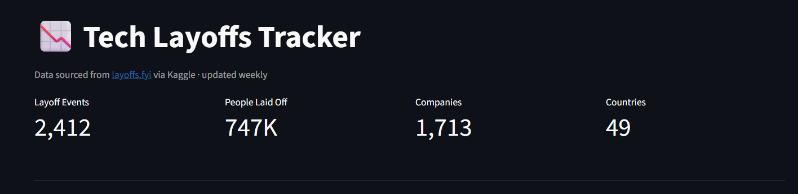
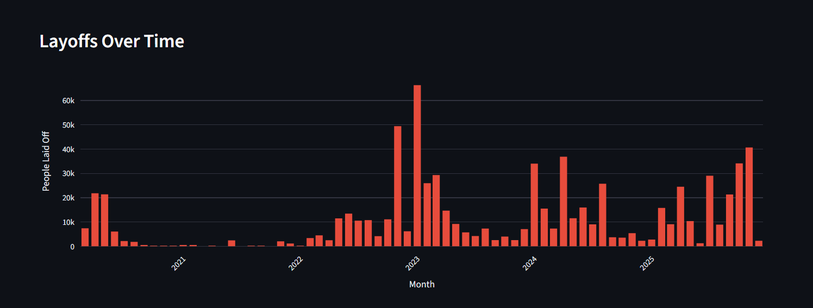
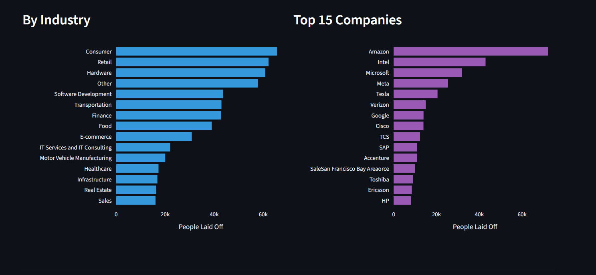
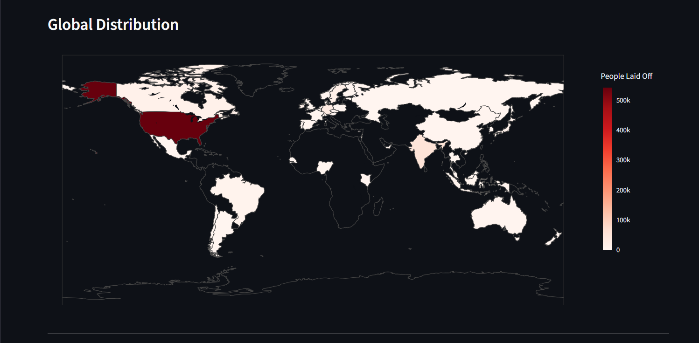
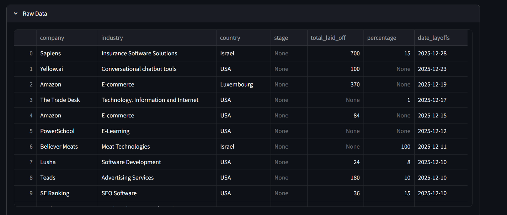
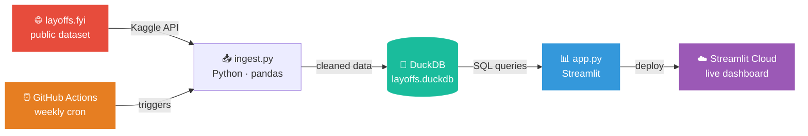

# 📉 Tech Layoffs Tracker

Interactive dashboard tracking tech industry layoffs from 2020 to 2025, built with real data from [layoffs.fyi](https://layoffs.fyi).

**[Live Demo →](https://layoffs-tracker-mdndinr8hfct5afvjwvjno.streamlit.app)**

---

## Screenshots

| Overview & KPIs | Layoffs Over Time |
|---|---|
|  |  |

| By Industry & Top Companies | Global Map |
|---|---|
|  |  |

| Raw Data Explorer |
|---|
|  |

---

## What's inside

**2,412 layoff events** across **1,713 companies** in **49 countries** — every record sourced from layoffs.fyi, the definitive tracker of tech layoffs since COVID-19.

### Dashboard sections

| Section | What it shows |
|---|---|
| KPI Cards | Total events, people laid off, companies, countries |
| Layoffs Over Time | Monthly bar chart — spot the 2022–2023 wave clearly |
| By Industry | Consumer, Retail, Hardware lead — not just "Big Tech" |
| Top 15 Companies | Amazon, Intel, Microsoft dominate the numbers |
| Funding Stage | Post-IPO companies account for the majority of cuts |
| Global Map | Choropleth — US dominates, India and UK follow |

All sections respond to sidebar filters: year, industry, country.

---

## Architecture



## Tech stack

| Layer | Tool |
|---|---|
| Data source | layoffs.fyi via Kaggle dataset |
| Ingestion | Python + pandas (`ingest.py`) |
| Storage | DuckDB (embedded, file-based) |
| Dashboard | Streamlit + Plotly |
| Hosting | Streamlit Community Cloud |
| Automation | GitHub Actions (weekly refresh) |

---

## Run locally

```bash
git clone https://github.com/evgeniimatveev/layoffs-tracker
cd layoffs-tracker
python -m venv .venv && .venv/Scripts/activate
pip install -r requirements.txt
# add your kaggle.json to ~/.kaggle/ then:
python ingest.py
streamlit run app.py
```

---

## Key findings

- **2023 was the peak** — over 60K people laid off in a single month (January 2023)
- **Post-IPO companies** cut the most people in absolute numbers
- **Consumer & Retail** lead by industry — hardware companies follow closely
- **Amazon alone** accounts for ~70K layoffs across multiple events

---

*Data: [layoffs.fyi](https://layoffs.fyi) via Kaggle · Updated weekly*
